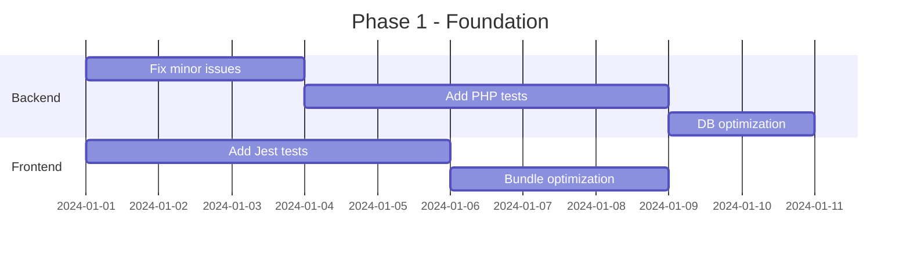
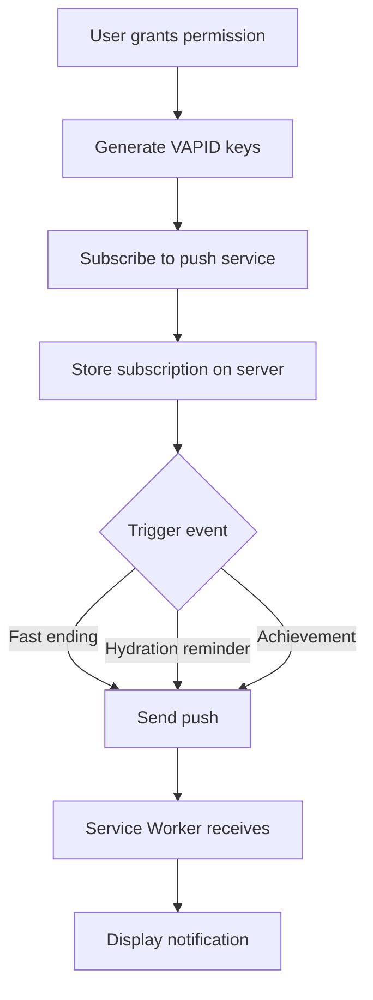
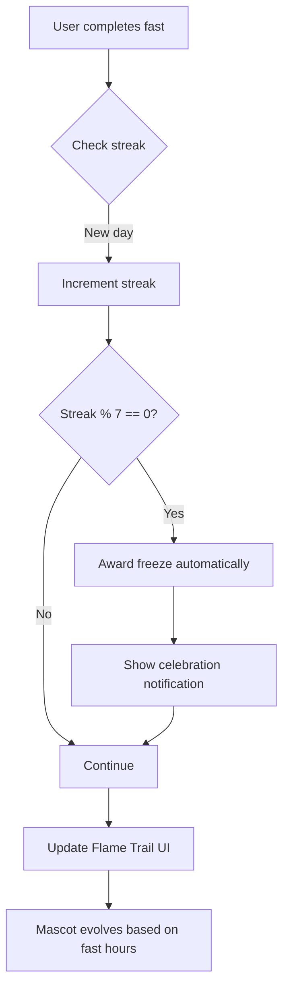
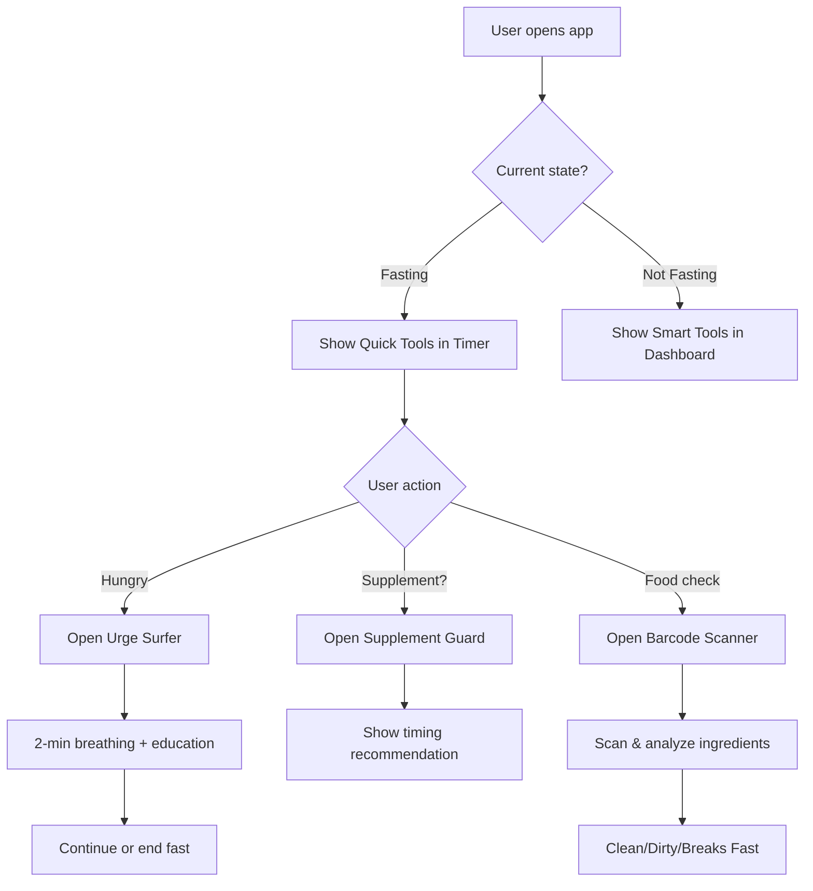
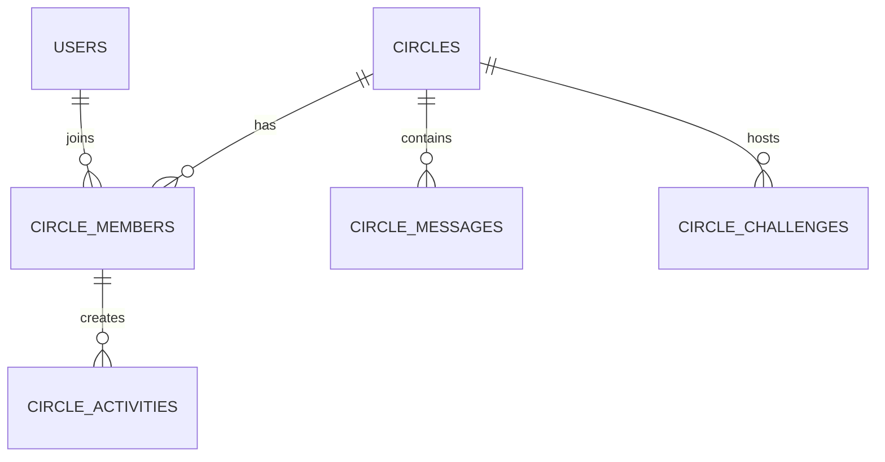
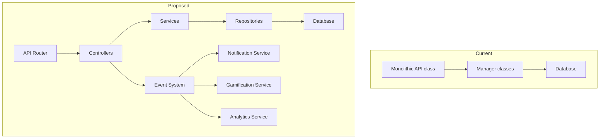
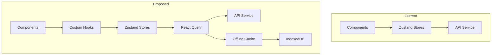

# FastTrack Elite - Comprehensive Code Review & v3.0 Roadmap

## 🔒 Security Fixes Verification

### ✅ Successfully Implemented

| Fix | Location | Status | Verification |
|-----|----------|--------|--------------|
| Permission callbacks | `class-fasttrack-api.php:479-501` | ✅ Complete | Returns `is_user_logged_in()` |
| Testing bypass removal | `class-fasttrack-api.php` | ✅ Complete | All 9 instances replaced with proper auth checks |
| Authorization check on get_fast | `class-fasttrack-api.php:520-539` | ✅ Complete | Checks user ownership before returning fast |
| Timezone handling | `class-fasttrack-fasting-manager.php:32-42` | ✅ Complete | Uses `current_time()` with fallback |
| Unused imports cleanup | `Dashboard.tsx:3-7` | ✅ Complete | Heart, Snowflake removed |
| Documentation updates | `README.md:583-596` | ✅ Complete | Correct property names |
| Version mismatch | `fasttrack.php:17` | ✅ Complete | Now shows 2.0.0 |

### ⚠️ Minor Remaining Issues

| Issue | Location | Severity | Fix Required |
|-------|----------|----------|--------------|
| PHP date() in notifications | `class-fasttrack-notifications.php:45` | Low | Use `current_time()` |
| Hardcoded URLs in social | `class-fasttrack-social.php:44` | Low | Use WordPress `home_url()` |
| Missing input validation | Various endpoints | Medium | Add sanitization |

---

## 📊 Current Feature Matrix

### Core Functionality
| Feature | Status | Notes |
|---------|--------|-------|
| Fasting Timer | ✅ Complete | Start, end, pause, resume, backdate |
| Fasting Zones | ✅ Complete | Visual progress through metabolic states |
| Weight Tracking | ✅ Complete | Log entries with charts |
| Hydration Tracking | ✅ Complete | Daily goals with quick-add |
| Mood Tracking | ✅ Complete | Energy, hunger, mood logging |
| Meal Logging | ⚠️ Basic | No nutrition calculations |
| Analytics | ✅ Complete | Multiple charts, time ranges |
| Calendar Heatmap | ✅ Complete | Activity visualization |

### Gamification
| Feature | Status | Notes |
|---------|--------|-------|
| XP & Points | ✅ Complete | Earn points for actions |
| Levels | ✅ Complete | Progress through levels |
| Achievements | ✅ Complete | Unlock badges |
| Streaks | ✅ Complete | Daily consistency tracking |
| Streak Freezes | ✅ Complete | Protect streaks, auto-earn at 7-day milestones |
| Leaderboard | ✅ Complete | Global rankings |
| **Flame Mascot** | ✅ **NEW** | 4-phase animated character (Ember → Warming → Burning → Inferno) |
| **Streak Flame Trail** | ✅ **NEW** | Visual chain with intensity scaling |
| **7-Day Milestone Rewards** | ✅ **NEW** | Auto-earn freezes at 7, 14, 21... day milestones |

### Social
| Feature | Status | Notes |
|---------|--------|-------|
| Challenges | ⚠️ Partial | Join challenges, basic progress |
| Circles | 🔴 Placeholder | Returns empty array |
| Social Sharing | 🔴 Placeholder | Hardcoded URLs |
| Buddy System | 🔴 Not Implemented | Types defined only |

### Content
| Feature | Status | Notes |
|---------|--------|-------|
| Recipes | ✅ Complete | 100+ recipes, filters, pagination, favorites |
| Smart Coach | ⚠️ Basic | Simple tips, no AI |
| Cognitive Tests | ✅ Complete | Stroop, Reaction time |
| Cycle Sync | ✅ Complete | Menstrual cycle tracking |

### Smart Tools (Phase 2.6)
| Feature | Status | Notes |
|---------|--------|-------|
| **Bio-Adaptive Scheduler** | ✅ **NEW** | Readiness-based fasting recommendations |
| **Supplement Safe-Guard** | ✅ **NEW** | Timing guidance for 25+ supplements |
| **Urge Surfer (SOS)** | ✅ **NEW** | CBT-based 2-min breathing exercise |
| **Fasting Scanner** | ✅ **NEW** | Open Food Facts barcode scanning |
| **RPG Character** | ✅ **NEW** | Gamified character with XP/HP/Classes |
| **Live Rooms** | ✅ **NEW** | Real-time fasters count + commitments |

### Technical
| Feature | Status | Notes |
|---------|--------|-------|
| Browser Notifications | ✅ Complete | Request permission, send |
| Push Notifications | ✅ Complete | Service worker, VAPID, scheduled reminders |
| PWA | ✅ Complete | Custom SW, offline caching, notification handling |
| AI Food Scanner | ✅ Complete | Barcode + Open Food Facts integration |

---

## 🚀 v3.0 Update Roadmap

### Phase 1: Foundation & Stability (Weeks 1-2) ✅ COMPLETED
**Priority: Critical**
**Estimated Complexity: Medium**
**Status: ✅ All tasks completed**

1. **✅ Fix remaining minor issues**
   - ✅ Replace `date()` with `current_time()` in notifications class
   - ✅ Fix hardcoded URLs in social class
   - ✅ Add comprehensive input validation to all endpoints

2. **✅ Add unit tests for critical paths**
   - ✅ PHPUnit tests for API endpoints (tests/api/test-fasting-api.php)
   - ✅ Vitest tests for React stores (frontend/src/stores/fastingStore.test.ts)
   - ✅ Test infrastructure setup (phpunit.xml, tests/bootstrap.php)

3. **✅ Performance optimization**
   - ✅ Add database indexes for frequently queried columns
   - ✅ Implement query caching for leaderboard (15-minute transient)
   - ✅ Optimize frontend bundle size



---

### Phase 2: Push Notifications & PWA (Weeks 3-4) ✅ COMPLETED
**Priority: High**
**Estimated Complexity: High**
**Dependencies: Phase 1**
**Status: ✅ All tasks completed**

1. **✅ Service Worker implementation**
   - ✅ Create service worker for offline support (`frontend/src/sw.ts`)
   - ✅ Implement background sync for fasting data
   - ✅ Add push notification subscription

2. **✅ Server-side push infrastructure**
   - ✅ Web Push protocol implementation (`class-fasttrack-push-notifications.php`)
   - ✅ VAPID key generation and storage
   - ✅ Notification scheduling system (WordPress cron)

3. **✅ Notification triggers**
   - ✅ Fast start/end reminders (1 hour before & at target)
   - ✅ Hydration reminders at intervals (every 2 hours)
   - ✅ Achievement unlocked notifications
   - ✅ API endpoints for subscribe/unsubscribe



---

### Phase 2.5: Gamification Enhancement (Week 5) ✅ COMPLETED
**Priority: High**
**Estimated Complexity: Medium**
**Dependencies: Phase 1**
**Status: ✅ All tasks completed**

**Goal**: Implement aggressive but rewarding gamification using "Streak" psychology and a Virtual Companion to increase user retention without subscription requirements.

1. **✅ New Flame Mascot Character**
   - ✅ Replaced fox mascot with animated Flame SVG (`frontend/src/components/Mascot.tsx`)
   - ✅ 4 fasting-phase states based on elapsed hours:
     - **Resting** (0h idle): Small ember with sleepy face
     - **Warming Up** (0-12h): Flickering flame, eyes opening
     - **Fat Burn** (12-16h): Strong flame with "gym gear" headband
     - **Autophagy** (16h+): Super Saiyan inferno with cyan aura
   - ✅ Color gradient shifts from orange → yellow → blue-white
   - ✅ Particle effects (sparks) for high-intensity phases
   - ✅ Phase badge display below mascot

2. **✅ Streak Flame Trail Visualization**
   - ✅ New component (`frontend/src/components/StreakFlameTrail.tsx`)
   - ✅ Visual chain of flames representing last 7-14 days
   - ✅ Intensity scaling based on streak length:
     - 1-3 days: Small orange flames
     - 4-7 days: Medium flames with yellow tips
     - 8-14 days: Tall flames with white-hot core
     - 15+ days: Inferno with particles and "UNSTOPPABLE" badge
   - ✅ Frozen days (with freeze used) show blue frost-covered flames
   - ✅ Connecting ember trail animation between flames
   - ✅ Milestone progress bar showing days until next freeze reward

3. **✅ 7-Day Milestone Streak Freeze Earning**
   - ✅ Backend: `FastTrack_Streaks::check_streak_milestone_freeze()` in `class-fasttrack-streaks.php`
   - ✅ Auto-awards freeze at 7, 14, 21, 28... day milestones
   - ✅ Maximum 5 freezes stored
   - ✅ API: `end_fast` endpoint returns `freeze_earned` flag
   - ✅ Frontend: Celebratory notification when freeze earned
   - ✅ Updated `fastingStore.ts` to handle freeze response

4. **✅ Enhanced Streak Freeze UI**
   - ✅ Flame theme with orange/red/blue gradient (`frontend/src/components/StreakFreeze.tsx`)
   - ✅ Animated current streak display with floating particles
   - ✅ Frost-Flame hybrid icons for available freezes
   - ✅ Milestone progress bar showing days to next auto-earn
   - ✅ Updated info section explaining auto-earning

5. **✅ Dashboard Integration**
   - ✅ Integrated `StreakFlameTrail` in Dashboard for users with streaks
   - ✅ Streak Protection button with flame-shield icon
   - ✅ Flame Mascot displayed when fasting is active



**Files Changed:**
| File | Change |
|------|--------|
| `frontend/src/components/Mascot.tsx` | Complete rewrite - Flame character with 4 phases |
| `frontend/src/components/StreakFlameTrail.tsx` | New - Visual streak chain |
| `frontend/src/components/StreakFreeze.tsx` | Flame theme + milestone progress |
| `frontend/src/components/Dashboard.tsx` | Integrated flame trail + mascot |
| `frontend/src/components/Timer/index.tsx` | Updated Mascot props |
| `frontend/src/stores/fastingStore.ts` | Handle freeze_earned response |
| `frontend/src/services/notifications.ts` | Added notifyAchievement() |
| `includes/class-fasttrack-streaks.php` | 7-day milestone freeze logic |
| `includes/class-fasttrack-api.php` | Return freeze_earned in end_fast |

---

### Phase 2.6: Smart Tools & Retention Features (Week 6) ✅ COMPLETED
**Priority: High**
**Estimated Complexity: Medium-High**
**Dependencies: Phase 2.5**
**Status: ✅ All tasks completed**

**Goal**: Implement 6 high-retention features focusing on personalization, utility, and engagement without requiring a subscription model.

1. **✅ Bio-Adaptive "Smart" Scheduler**
   - Enhanced `DailyCheckin.tsx` with readiness questions
   - Sleep Quality (Poor/Average/Good)
   - Stress Level (Low/Medium/High)
   - Physical Soreness (None/Mild/Severe)
   - Recommendation algorithm suggests:
     - **Restorative Fast** (12-14h) if sleep poor OR stress high OR soreness severe
     - **Challenge Fast** (18-20h) if sleep good AND stress low
   - Backend stores readiness data in `wp_fasttrack_checkins` table

2. **✅ Supplement Safe-Guard (Pill Manager)**
   - New component `SupplementManager.tsx`
   - JSON database of 25+ common supplements (`supplements.json`)
   - Each supplement tagged with `requires_food`, `timing`, `category`
   - Real-time recommendations based on fasting state:
     - "Safe to take now" vs "Wait for eating window"
     - "Will break your fast!" warnings
   - Categories: Vitamins, Minerals, Amino Acids, Herbs & Botanicals, Other
   - Redesigned Add Supplement modal with:
     - Gradient header with search
     - Category filter pills
     - FAST-SAFE badges for fasting-friendly supplements
     - Card-based layout with timing badges

3. **✅ Urge Surfer (CBT-Based SOS Button)**
   - New component `UrgeSurfer.tsx`
   - 2-minute breathing exercise with visual guide
   - 4-7-8 breathing pattern (Inhale-Hold-Exhale)
   - Educational ghrelin facts rotation
   - Motivational quotes
   - Decision phase: Continue fast or end with grace
   - Awards XP for successfully surfing urges
   - Accessible from Dashboard and Timer Quick Tools

4. **✅ "Clean" vs "Dirty" Scanner (Open Food Facts Integration)**
   - New component `FastingScanner.tsx`
   - New service `openFoodFacts.ts`
   - Barcode scanning via `html5-qrcode` library
   - Open Food Facts API integration
   - Categorizes foods as:
     - **CLEAN FAST** - No fasting breakers
     - **DIRTY FAST** - Contains artificial sweeteners/gums
     - **BREAKS FAST** - Contains sugar, dextrose, etc.
   - Manual barcode entry option
   - Shows ingredient breakdown and sugar content

5. **✅ Fasting RPG Character System**
   - New component `RPGCharacter.tsx` with `RPGStatCard`
   - New store `rpgStore.ts`
   - New manager `class-fasttrack-rpg-manager.php`
   - Three character classes:
     - **The Monk** - Bonus XP for long, clean fasts
     - **The Warrior** - Bonus XP for consistency & streaks
     - **The Explorer** - Bonus XP for trying new protocols
   - XP system: 1 hour fasting = 10 XP
   - HP system: Take damage for breaking fasts early
   - Level progression with visual character evolution
   - Inventory system for streak freezes and cosmetics
   - Database table: `wp_fasttrack_rpg_characters`

6. **✅ Social "Live Rooms"**
   - New component `LiveRooms.tsx`
   - "Who is Fasting Right Now?" dashboard
   - Real-time global/duration-based fasting counts
   - Commitment Contracts feature:
     - Set fasting target with accountability partner
     - Shareable commitment links
     - "Shame notification" system for broken commitments
   - API endpoints: `/live-fasters`, `/commitments`

7. **✅ Smart Tools Integration**
   - **Timer Tab**: Quick Tools section (Urge SOS, Supplements, Scan Food)
   - **Tracking Tab**: Barcode Scanner alongside AI Food Scanner
   - **Social Tab**: Live Rooms button in header
   - **Settings Tab**: Supplement Safe-Guard section
   - **Dashboard**: All 6 smart tools in dedicated grid



**Files Changed:**
| File | Change |
|------|--------|
| `frontend/src/components/DailyCheckin.tsx` | Added readiness questions |
| `frontend/src/components/SupplementManager.tsx` | Complete rewrite with new UI |
| `frontend/src/components/UrgeSurfer.tsx` | New CBT-based breathing tool |
| `frontend/src/components/FastingScanner.tsx` | New barcode scanner |
| `frontend/src/components/RPGCharacter.tsx` | New RPG character display |
| `frontend/src/components/LiveRooms.tsx` | New social live rooms |
| `frontend/src/components/Timer/index.tsx` | Added Quick Tools section |
| `frontend/src/components/Tracking.tsx` | Added Barcode Scanner |
| `frontend/src/components/Social.tsx` | Added Live Rooms button |
| `frontend/src/components/Settings.tsx` | Added Supplement section |
| `frontend/src/components/Dashboard.tsx` | Smart tools grid |
| `frontend/src/stores/rpgStore.ts` | New RPG state management |
| `frontend/src/services/openFoodFacts.ts` | New Open Food Facts service |
| `frontend/src/data/supplements.json` | New supplements database |
| `includes/class-fasttrack-rpg-manager.php` | New RPG manager |
| `includes/class-fasttrack-api.php` | New endpoints for RPG, Live Rooms |
| `includes/class-fasttrack-activator.php` | New database tables |
| `includes/class-fasttrack-checkins-manager.php` | Readiness fields |

---

### Phase 3: Social Circles (Weeks 7-9)
**Priority: High**
**Estimated Complexity: High**
**Dependencies: Phase 2.6**

1. **Database schema for circles**
   ```sql
   CREATE TABLE fasttrack_circles
   CREATE TABLE fasttrack_circle_members
   CREATE TABLE fasttrack_circle_messages
   CREATE TABLE fasttrack_circle_activities
   ```

2. **Circle features**
   - Create public/private circles
   - Invite via code or direct invite
   - Circle chat/activity feed
   - Group challenges
   - Circle leaderboard

3. **Privacy controls**
   - Choose what to share with circle
   - Mute/leave circles
   - Admin controls for circle owners



---

### Phase 4: Advanced Analytics & Reporting (Weeks 9-10)
**Priority: Medium**
**Estimated Complexity: Medium**
**Dependencies: Phase 1**

1. **Enhanced statistics**
   - Weekly/monthly trend analysis
   - Correlation insights - best fasting days, optimal duration
   - Goal prediction based on history
   - Exportable reports - PDF/CSV

2. **Personalized insights**
   - Pattern recognition in fasting habits
   - Recommendations based on performance
   - Comparison with similar users - anonymized

3. **Dashboard widgets**
   - Customizable widget layout
   - More chart types - radar, comparison
   - Mini goal trackers

---

### Phase 5: Meal Logging Improvements (Weeks 11-12)
**Priority: Medium**
**Estimated Complexity: Medium**
**Dependencies: Phase 1**

1. **Nutrition database integration**
   - USDA FoodData Central API
   - Macro/micro tracking
   - Meal templates

2. **AI Food Scanner - MVP**
   - OpenAI Vision API integration
   - Food recognition from photos
   - Portion estimation

3. **Meal planning**
   - Suggested meals based on fasting window
   - Breaking fast meal recommendations
   - Weekly meal prep suggestions

---

### Phase 6: Health Integrations (Weeks 13-15)
**Priority: Low**
**Estimated Complexity: High**
**Dependencies: Phases 1-3**

1. **Apple Health integration**
   - Read weight from HealthKit
   - Sync hydration data
   - Export fasting data

2. **Google Fit integration**
   - Similar sync capabilities
   - Activity data correlation

3. **Wearable support**
   - Fitbit API integration
   - Garmin Connect

---

## 📐 Architecture Improvements

### Backend


### Frontend


---

## 📋 Implementation Priority Matrix

| Feature | Business Value | Technical Complexity | Dependencies | Priority Score |
|---------|---------------|---------------------|--------------|----------------|
| Push Notifications | High | High | Phase 1 | ✅ Done |
| Gamification Enhancement | High | Medium | Phase 1 | ✅ Done |
| **Smart Tools (Phase 2.6)** | High | Medium-High | Phase 2.5 | ✅ Done |
| Social Circles | High | High | Phase 1 | 🔥 8/10 |
| Advanced Analytics | Medium | Medium | Phase 1 | 7/10 |
| Meal Improvements | Medium | Medium | Phase 1 | 6/10 |
| Health Integrations | Low | High | Phases 1-3 | 5/10 |

---

## 🎯 Success Metrics

### v3.0 Goals
- **Performance**: API response time < 200ms for 95th percentile
- **Reliability**: 99.9% uptime for critical endpoints
- **Engagement**: 30% increase in DAU after push notifications ✅
- **Retention**: 40% improvement in 7-day retention with flame gamification ✅
- **Streak Psychology**: 25% reduction in streak breaks with freeze system ✅
- **Tool Adoption**: 50%+ users engaging with at least 2 smart tools ✅
- **Urge Surfing**: 20% reduction in early fast breaks using Urge Surfer ✅
- **Social Engagement**: 15% users creating commitment contracts ✅

### Test Coverage Targets
- PHP Backend: 80% line coverage
- React Frontend: 70% statement coverage
- E2E Tests: Critical user flows covered

---

## 📅 Timeline Summary

| Phase | Duration | Start | End | Status |
|-------|----------|-------|-----|--------|
| Phase 1: Foundation | 2 weeks | Week 1 | Week 2 | ✅ COMPLETED |
| Phase 2: Push Notifications | 2 weeks | Week 3 | Week 4 | ✅ COMPLETED |
| Phase 2.5: Gamification Enhancement | 1 week | Week 5 | Week 5 | ✅ COMPLETED |
| Phase 2.6: Smart Tools | 1 week | Week 6 | Week 6 | ✅ COMPLETED |
| Phase 3: Social Circles | 3 weeks | Week 7 | Week 9 | Planned |
| Phase 4: Analytics | 2 weeks | Week 10 | Week 11 | Planned |
| Phase 5: Meal Logging | 2 weeks | Week 12 | Week 13 | Planned |
| Phase 6: Health Integrations | 3 weeks | Week 14 | Week 16 | Future |

**Total Timeline: 16 weeks for full v3.0 release**

---

## 🔧 Technical Debt to Address

1. **Code Organization**
   - Split large API class into controllers
   - Implement proper dependency injection
   - Add interfaces for manager classes

2. **Error Handling**
   - Centralized error handling
   - Structured error responses
   - Frontend error boundaries

3. **Documentation**
   - API documentation with OpenAPI/Swagger
   - Component documentation with Storybook
   - Architecture decision records

---

## 🎨 Recent UI/UX Improvements

### Gamification Visual System (Phase 2.5)
- **Flame Character**: Emotional connection through visual transformation
- **Streak Chain**: "Don't Break the Chain" psychology with fire metaphor
- **Milestone Rewards**: Positive reinforcement at predictable intervals
- **Frost-Flame Freezes**: Visual hybrid representing protection of flame

### Smart Tools System (Phase 2.6)
- **Bio-Adaptive Scheduler**: Personalized fasting recommendations based on readiness
- **Supplement Safe-Guard**: Redesigned modal with gradient header, FAST-SAFE badges, category pills
- **Urge Surfer**: Calming CBT-based breathing exercise with 4-7-8 pattern
- **Fasting Scanner**: Clean barcode scanning with clear Clean/Dirty/Breaks categorization
- **RPG Character**: Visual avatar with class selection and level progression
- **Live Rooms**: Real-time social dashboard with commitment contracts

### Design Principles Applied
1. **Progress Visibility**: Users see their streak as tangible flames
2. **Loss Aversion**: Breaking the chain is visually impactful
3. **Reward Anticipation**: Milestone progress bar creates motivation
4. **Achievement Recognition**: Celebratory notifications for freezes
5. **Contextual Access**: Smart tools appear in relevant tabs (Timer, Tracking, Social)
6. **Decision Support**: Supplement timing and food scanning reduce cognitive load
7. **Social Accountability**: Commitment contracts leverage public commitment psychology

---

*Document created: December 2024*
*Last updated: December 2024 (Phase 2.6 completed)*
*Next review: After Phase 3 completion*
